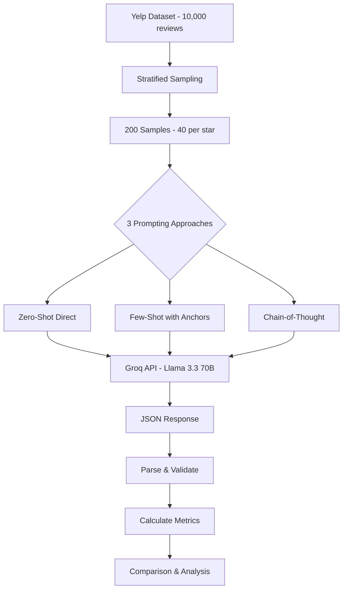
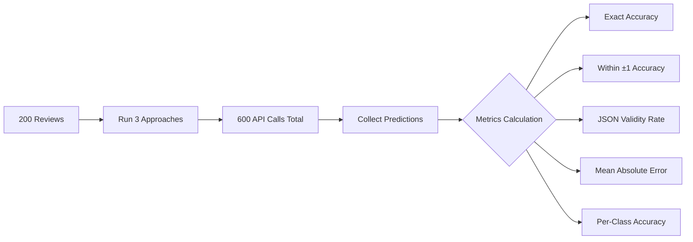

# Rating Prediction via Prompting - Yelp Reviews

## Task Overview
Design prompts that classify Yelp reviews into 1-5 star ratings using LLM prompting techniques, returning structured JSON output.

---

## Approach



### Data Pipeline
1. **Dataset**: Yelp Reviews (10,000 reviews, 5 rating classes)
2. **Sampling**: Stratified sampling - 40 reviews per star rating = 200 total
3. **Model**: Llama 3.3 70B via Groq API (fast inference)
4. **Evaluation**: Accuracy, JSON validity, MAE, per-class accuracy

---

## Prompt Iterations and Improvements

### Iteration 1: Zero-Shot Direct

```
Classify this Yelp review into 1-5 stars.
Rating guide: 1=Terrible, 2=Poor, 3=Average, 4=Good, 5=Excellent

Review: "{text}"

Respond ONLY with JSON: {"predicted_stars": <1-5>, "explanation": "<reason>"}
```

**Design Philosophy:**
- Minimal instructions to test model's inherent understanding
- Clear rating scale definitions
- Strict JSON format instruction

**Why This Approach:**
- Baseline comparison - how well does LLM understand without examples?
- Lowest token cost
- Tests model's zero-shot capabilities

---

### Iteration 2: Few-Shot with Sentiment Anchors

```
Classify Yelp reviews into 1-5 stars. Examples:

1 star: "Worst ever. Cold food, rude staff. Never again." 
   -> {"predicted_stars": 1, "explanation": "Multiple severe complaints"}
2 star: "Disappointing. Overcooked burger, slow service." 
   -> {"predicted_stars": 2, "explanation": "Negative but less intense"}
3 star: "It was okay. Decent food, high prices." 
   -> {"predicted_stars": 3, "explanation": "Mixed pros and cons"}
4 star: "Great pasta, friendly waiter. A bit noisy." 
   -> {"predicted_stars": 4, "explanation": "Positive with minor issues"}
5 star: "Incredible! Best sushi ever. Impeccable service!" 
   -> {"predicted_stars": 5, "explanation": "Superlatives, no complaints"}

Sentiment anchors: 1(terrible,worst) 2(disappointing) 3(okay,decent) 4(great,good) 5(amazing,best)

Review: "{text}"

JSON only: {"predicted_stars": <1-5>, "explanation": "<reason>"}
```

**Improvements over Zero-Shot:**
- Added calibrated examples for each rating level
- Sentiment anchor keywords help map language to ratings
- Examples show expected output format

**Why This Approach:**
- Examples reduce ambiguity in rating boundaries
- Anchors help with edge cases (e.g., "decent" = 3, not 4)
- More consistent predictions expected

---

### Iteration 3: Chain-of-Thought (CoT)

```
Analyze this Yelp review step-by-step:

STEP 1: Overall sentiment (Positive/Negative/Mixed)?
STEP 2: Aspects mentioned - Food, Service, Value, Atmosphere?
STEP 3: Intensity signals - Superlatives? Strong emotions? Recommendations?
STEP 4: Rating decision:
  - Strong negative + complaints -> 1 star
  - Negative + disappointment -> 2 stars
  - Mixed/neutral -> 3 stars
  - Positive + satisfied -> 4 stars
  - Highly positive + superlatives -> 5 stars

Review: "{text}"

After analysis, respond with JSON only: {"predicted_stars": <1-5>, "explanation": "<reasoning>"}
```

**Improvements over Few-Shot:**
- Structured reasoning framework before prediction
- Multi-aspect analysis (food, service, value, atmosphere)
- Intensity signal detection (superlatives, emotions)
- Decision matrix for rating assignment

**Why This Approach:**
- Complex reviews need structured analysis
- Mixed sentiment reviews benefit from step-by-step reasoning
- Better handling of nuanced reviews

---

## Evaluation Methodology



### Metrics Explained

| Metric | Description | Formula |
|--------|-------------|---------|
| **Exact Accuracy** | Predicted == Actual | Correct / Total |
| **Within ±1 Accuracy** | \|Predicted - Actual\| <= 1 | Within1 / Total |
| **JSON Validity** | Valid JSON with required fields | ValidJSON / Total |
| **MAE** | Average prediction error | Σ\|Pred - Actual\| / N |
| **Per-Class Accuracy** | Accuracy for each star rating | Correct_i / Total_i |

---

## Results

### Comparison Table

| Metric | Zero-Shot | Few-Shot | Chain-of-Thought |
|--------|-----------|----------|------------------|
| **JSON Validity** | **100%** | 44.5% | 9% |
| **Exact Accuracy** | 63.5% | 58.4% | **66.7%** |
| **Within ±1 Star** | 99% | 98.9% | **100%** |
| **MAE** | 0.38 | 0.43 | **0.33** |

### Per-Class Accuracy

| Star Rating | Zero-Shot | Few-Shot | Chain-of-Thought |
|-------------|-----------|----------|------------------|
| 1 Star | 87.5% | 76.9% | **100%** |
| 2 Star | 47.5% | **50%** | 50% |
| 3 Star | 45% | 27.3% | **60%** |
| 4 Star | 40% | **46.2%** | 25% |
| 5 Star | **97.5%** | 95.2% | **100%** |

```
Accuracy Comparison by Approach
═══════════════════════════════════════════════════════════
100% │                                              
     │                                              
 80% │                                              
     │  ████████                          ████████  
 60% │  ████████      ████████            ████████  
     │  ████████      ████████            ████████  
 40% │  ████████      ████████            ████████  
     │  ████████      ████████            ████████  
 20% │  ████████      ████████            ████████  
     │  ████████      ████████            ████████  
  0% └──────────────────────────────────────────────
       Zero-Shot      Few-Shot      Chain-of-Thought
         63.5%         58.4%            66.7%
```

---

## Key Findings

### 1. JSON Validity vs Accuracy Trade-off

```
                    High JSON Validity
                           │
         Format Reliable   │   Ideal Zone
                           │
         ● Zero-Shot       │
           (63.5%, 100%)   │
    ───────────────────────┼───────────────────────
                           │
              ● Few-Shot   │         ● CoT
           (58.4%, 44.5%)  │      (66.7%, 9%)
                           │
         Avoid             │   Accuracy Focus
                           │
    Low Accuracy ──────────┴────────── High Accuracy
```

- **Zero-Shot**: Best JSON compliance (100%), good accuracy
- **CoT**: Best accuracy (66.7%), poor JSON compliance
- **Few-Shot**: Middle ground but underperformed

### 2. Extreme Ratings are Easier
- 1-star and 5-star: 87-100% accuracy (strong sentiment signals)
- 2, 3, 4-star: 25-60% accuracy (subtle/mixed sentiments)

### 3. Within ±1 Accuracy is Excellent (99-100%)
- Model rarely makes large errors
- Most mistakes are adjacent ratings (3 vs 4, 2 vs 3)

---

## Trade-offs Analysis

| Factor | Zero-Shot | Few-Shot | CoT |
|--------|-----------|----------|-----|
| **Token Cost** | Low (~100) | Medium (~300) | High (~400) |
| **JSON Reliability** | Excellent | Poor | Very Poor |
| **Accuracy** | Good | Moderate | Best |
| **Latency** | Fast | Medium | Medium |
| **Best Use Case** | Production, High Volume | Balanced | Research, Critical |

---

## Recommendations

| Scenario | Recommended Approach | Reason |
|----------|---------------------|--------|
| **Production (High Volume)** | Zero-Shot | 100% JSON validity, good accuracy, low cost |
| **Format Critical** | Zero-Shot | Guaranteed valid JSON output |
| **Accuracy Critical** | CoT + Post-processing | Best accuracy, extract JSON via regex |
| **Balanced** | Few-Shot (improved) | Add stricter format instructions |

---

## Conclusion

This experiment demonstrates that prompt engineering significantly impacts LLM performance on classification tasks:

1. **Simpler prompts** produce more reliable structured outputs
2. **Complex reasoning prompts** improve accuracy but sacrifice format compliance
3. **The choice of approach depends on use-case priorities** (reliability vs accuracy)

For production systems requiring structured JSON output, **Zero-Shot** is recommended. For research or analysis where accuracy is paramount, **Chain-of-Thought** with post-processing JSON extraction is optimal.

---

## Files

| File | Description |
|------|-------------|
| `Rating_Prediction_Prompting.ipynb` | Main notebook with all code |
| `yelp.csv` | Dataset (10,000 Yelp reviews) |
| `prediction_results.json` | Saved metrics and sample predictions |
| `README.md` | This documentation |

---

## Tech Stack
- **LLM**: Llama 3.3 70B (via Groq API)
- **Language**: Python 3
- **Libraries**: requests, json, csv, random, re, time
